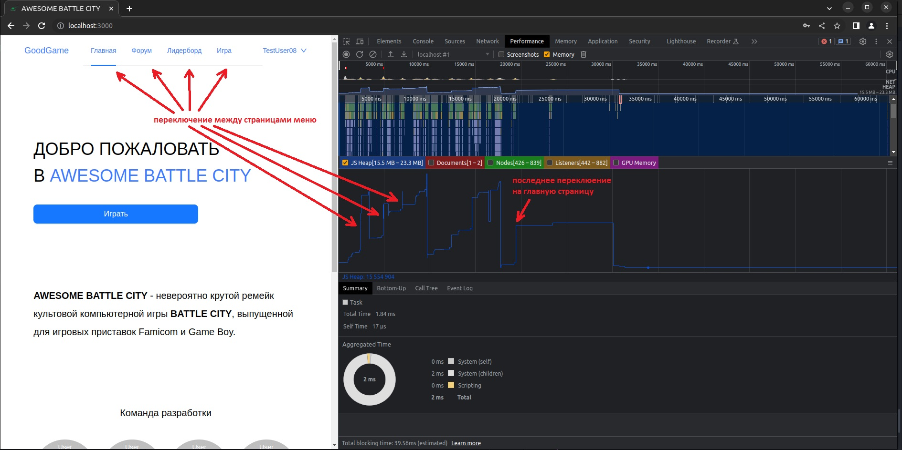
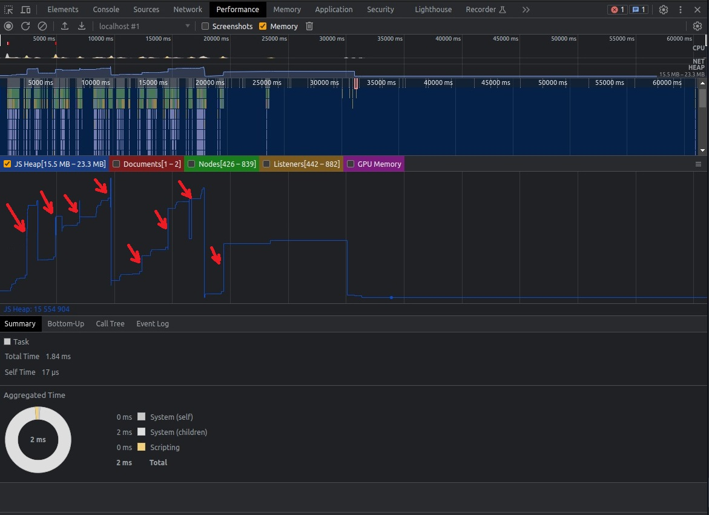
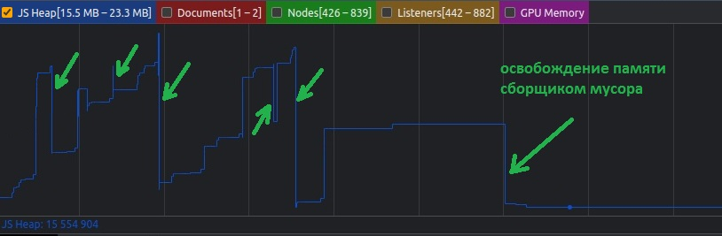
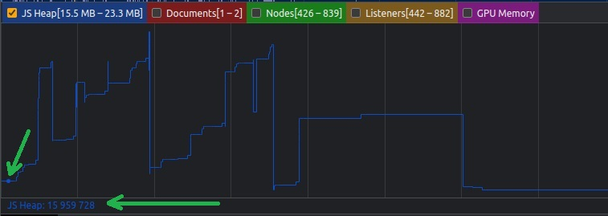
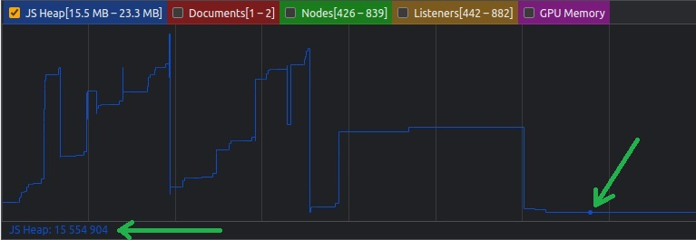

### Поиск утечек памяти

## Инструменты разработчика

Для поиска утечек памяти в JS были использованы инструменты разработчика (Dev Tools) браузера Google Chrome.

Они могут быть вызваны в браузере сочетанием клавиш Ctrl+Shift+I либо найдены в настройках:

_Настройка и управление Google Chrome_ -> _Другие инструменты_ -> _Инструменты разработчика_

Для исследования памяти - вкладка _Performance_ с выставленной галочкой _Memory_

## Ход исследования

Для выявления утечек памяти была сделана запись в течение примерно 60 секунд.

В первые 20 секунд происходило переключение между страницами меню,
после чего был возврат на главную страницу и в последующие 40 секунд не было произведено никаких действий.

На графике виден рост памяти при переходах на новые страницы:

Также видна работа сборщика мусора

(при этом важно отметить, что в последний раз сборщик мусора отрабатывает примерно на 30 секунде, после чего память возращается к первоначальному состоянию)

Если сравнить значение JS Heap в начале и в конце теста, то можно заметить, что утечек памяти нет:

## Вывод

В ходе исследования утечек памяти не обнаружено
